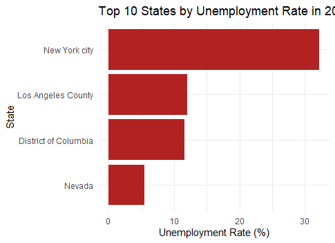
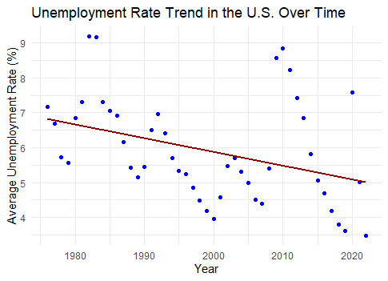

# Unemployment Analysis in the United States

## Overview
This project explores unemployment patterns across U.S. states and over time, using both exploratory data analysis and linear regression modeling.

## Objective
- Visualize state-level unemployment rates.
- Analyze national unemployment trends over time.
- Predict changes in unemployment based on year-to-year data.

## Tools Used
- R
- dplyr
- ggplot2
- readxl

## Key Findings
- **Top Unemployment Regions (2023):** New York City, Los Angeles County, and the District of Columbia had the highest unemployment rates.
- **National Trend:** The national average unemployment rate has generally declined over the past several decades.
- **Model Results:** Linear regression confirmed a statistically significant negative relationship between year and unemployment rate (p-value = 0.01082).
- **R-squared Value:** 13.6% of the variation in unemployment rate can be explained by time alone.

## Visualizations

### Top 10 States by Unemployment Rate (2023)

---

### National Unemployment Rate Trend Over Time

---

## Files
- `unemployment_analysis.R` — Full R script including data loading, cleaning, visualization, and modeling.
- `Top10.png` — Bar chart of the top 10 U.S. regions with the highest unemployment rates.
- `Trend.png` — Scatter plot with regression line showing national unemployment trends over time.

## How to Run
1. Install required R libraries: `readxl`, `dplyr`, `ggplot2`.
2. Load the `unemployment_analysis.R` script into RStudio or your preferred R environment.
3. Ensure the Excel dataset is accessible or update the file path.
4. Run all code sections sequentially to reproduce the visualizations and model.
